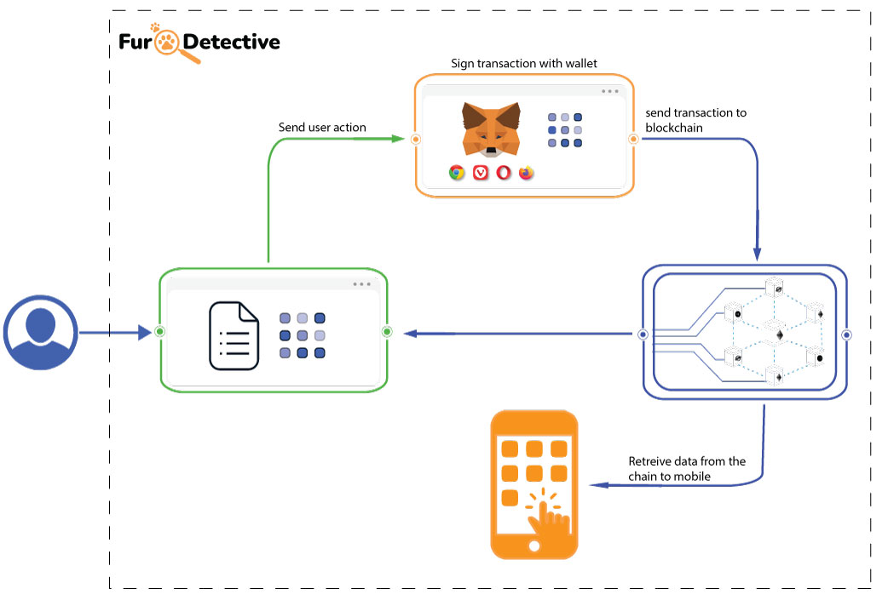
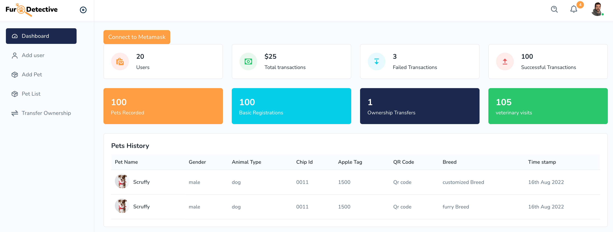
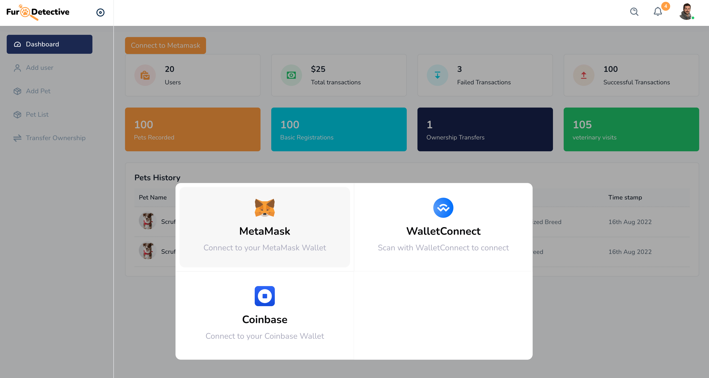
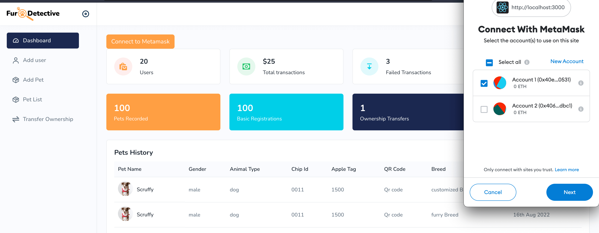

# Project Description


## [FurDetective.io](https://furdetective.io)

75% of lost pets tragically never return home, and pets can’t tell you where their home is or any medical needs they might have. In 2022, if your pet goes on an adventure, you have three terrible options. Go searching on foot, call around shelters, or put up posters.  

FurDetective enables pet owners to register their pets and find them using a proprietary blockchain-powered match algorithm and Pet Guardian identification system. It creates a probability match utilizing an array of multiple IDs to identify a pet from one or more devices, be it a micro-chip, IoT device, or Apple AirTags OR, you can use a specially generated FurDetective QR code!  

Pet parents need to register their pets on FurDetective. Once registered, anyone can easily find the owner if a pet is lost using one of the abovementioned identifications. Owners can control their privacy until a ‘rescue me’ alert is issued. Searching for a pet is furever free.  

The blockchain allows us to pass records of a pet through its life stages and, if needed, across multiple owners. Over time, as your pet grows up, their complete medical information can also be updated and recorded.  

Pets are one of the largest industries in Canada, generating over $7B+ in 2020. In comparison, Tesla’s 2021 global car sales were 5.5 billion. FurDetective uses the blockchain to bypass many legacy systems that don’t work, providing a simple, clean, and easy solution.

Our mission is to ensure that every pet gets loved in their own home.


# Project Overview

Download: [FurDetective Lean Canvas.pdf](https://github.com/kenmartey/furdetective/files/9365804/FurDetective.Lean.Canvas.pdf)

# Requirements
A public blockchain based bApp (Blockchain Application) that tracks the pets ownership.

A State record for each pet that includes the following:  
• Pet chip ID, IoT, Apple Tag & Pet Detective QR code  
• Owner history  
• Medical history  
• Additional identification (Photos)  

The ability to search for pets by:  
• Pet chip ID.  
• IoT device.  
• Apple AirTag.  
• Pet Detective QR code.    
• Owner.  

## Architecture Plan


## State Machine Diagram


## Transaction Descriptions
The following transition actions change the state of the state machine. These include:

- Adoption or purchasing a pet
- Registering a pet.
- Transfering a pet.
- New pet owner registration.
- Pet registration de-activation.
- Pet lost or passed.

## State Data Descriptions
The transition changes has the following effect on the state. There are 4 states:

- Pet Guardian, no pet  
  _This state has no data, it is also the return state for lost or passed pets._
- Pet without WhiskerID registration  
  _The state change occurs when a person purchases or adopts a pet. It is also the return state for when a owner wants to de-activate a registration._
- Registered pet on FurDetective with WhiskerID  
  _This state occurs when either a pet is registered or when a pet has a new chip/IoT device/Apple Tag is added._
- Pet without owner  
  _This state is when a pet is adopted or transferred to a new pet owner._

## Project Plan


## Timeline & Phases


# Tech Requirements

## Prerequisit

- Solidity
- Ganache
- Metamask
- Truffle framework
- node & npm

## Installation Process

clone the project

```sh
git clone https://github.com/kenmartey/furdetective.git
```

- start ganache

#### Deploy smart contract

- cd into project root folder and migrate/deploy contract

```sh
cd furdetective && truffle migrate
```

#### Run frontend

- cd into client

```sh
npm install
npm start
```

## Running project screenshots.

#### Dashboard home index



#### Selecting wallet to connect to



#### Connecting to Metamask wallet




## Team

- Nathan Harley (Project Lead)
- Kennedy Anyinatoe (Tech Lead)
