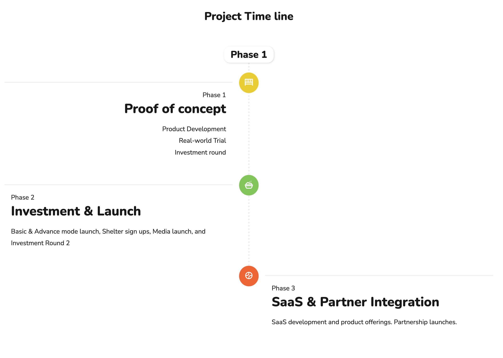

# Project Description


## [FurDetective.io](https://furdetective.io)

[FurDetective](https://furdetective.io) enables pet owners to register their pets and find them by chip ID or QR Codes.

# Project Overview

Download: [FurDetective Lean Canvas.pdf](https://github.com/kenmartey/furdetective/files/9365804/FurDetective.Lean.Canvas.pdf)

# Requirements
A public blockchain based bApp (Blockchain Application) that tracks the pets ownership.

A State record for each pet that includes the following:  
• Pet chip ID, IoT, Apple Tag & Pet Detective QR code  
• Owner history  
• Medical history  
• Additional identification (Photos)  

The ability to search for vehicles by:  
• Pet chip ID  
• IoT device  
• Apple AirTag
• Pet Detective QR code  
• Owner

## State Machine Diagram


## Transaction Descriptions
The following transition actions change the state of the state machine. These include:

- Adoption or purchasing a pet
- Registering a pet._
- Transfering a pet._
- New pet owner registration._
- Pet registration de-activation._
- Pet lost or passed._

## State Data Descriptions
The transition changes has the following effect on the state. There are 4 states:

- Pet Guardian, no pet  
  _This state has no data, it is also the return state for lost or passed pets._
- Pet without WhiskerID registration  
  _The state change occurs when a person purchases or adopts a pet. It is also the return state for when a owner wants to de-activate a registration._
- Registered pet on FurDetective with WhiskerID  
  _This state occurs when either a pet is registered or when a pet has a new chip/IoT device/Apple Tag is added._
- Pet without owner  
  _This state is when a pet is adopted or transferred to a new pet owner._

# Tech Requirements

## Prerequisit

- Solidity
- Ganache
- Metamask
- Truffle framework
- node & npm

## Installation Process

clone the project

```sh
git clone https://github.com/kenmartey/furdetective.git
```

- start ganache

#### Deploy smart contract

- cd into project root folder and migrate/deploy contract

```sh
cd furdetective && truffle migrate
```

#### Run frontend

- cd into client

```sh
npm install
npm start
```

## Running project screenshots.

#### Dashboard home index


#### Selecting wallet to connect to


#### Connecting to Metamask wallet


## State Machine Diagram

## Architecture Plan


## Project Plan & Timeline


## Marketing materials
Website: [FurDetective.io](https://furdetective.io)
Presentation: 


## Team

- Nathan Harley (Project Lead)
- Kennedy Anyinatoe (Tech Lead)
